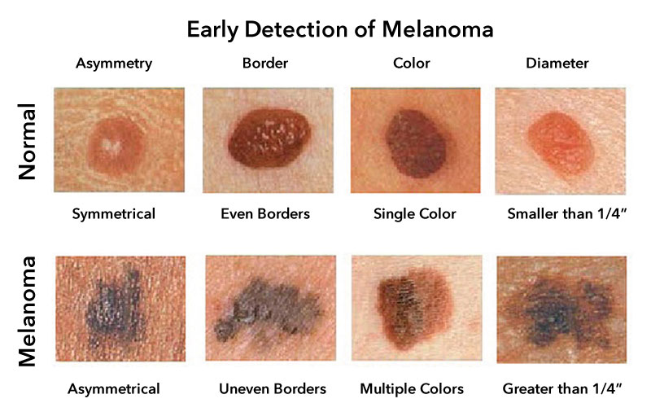

# Skin Cancer Classification using CNN

A project aimed at classifying skin cancer images into various categories using a Convolutional Neural Network (CNN).
Dataset : (https://www.kaggle.com/c/siim-isic-melanoma-classification/data)

## Table of Contents

- [General Info](#general-information)
- [Technologies Used](#technologies-used)
- [Observations](#observations)
- [Conclusions](#conclusions)
- [Acknowledgements](#acknowledgements)

## General Information

### Background

This project focuses on using deep learning techniques to classify skin lesions from images. Early and accurate diagnosis of skin cancer can significantly improve treatment outcomes.

### Business Problem

Dermatologists often require tools to assist in the classification of skin lesions. This model aims to provide accurate predictions to aid in medical diagnosis.

### Dataset

The dataset contains images of different types of skin lesions. The data is imbalanced, with certain classes dominating the dataset.

## Observations

- The class 'seborrheic keratosis' has the least number of samples in the dataset.
- The classes 'pigmented benign keratosis' and 'melanoma' dominate the data, comprising 20.6% and 19.5% of the samples, respectively.
- Overfitting was observed during the initial training phase, which was mitigated by applying data augmentation techniques.
- The inclusion of batch normalization was found to degrade accuracy and was therefore excluded from the final model.

## Conclusions

- The final model exhibits no signs of underfitting or overfitting.
- Class rebalancing significantly improved model performance on both training and validation data.
- After 30 epochs, the model achieved:
  - 80% training accuracy
  - 77% validation accuracy
- The small gap between training and validation accuracy indicates that the model generalizes well.

## Technologies Used

- Python 3.8+
- TensorFlow 2.x
- NumPy 1.21+
- Pandas 1.3+
- Seaborn 0.11+
- Matplotlib 3.4+

## Acknowledgements

- This project was inspired by advancements in medical imaging and CNN-based classification.
- Dataset and references provided by relevant research papers and open-source repositories.
- Special thanks to all contributors and tutorials that guided the implementation.
- This project was inspired by Live Presentation and Coding Session taken by `Shivam Garg`.
- This project is based on upGrad course material on [Convolutional Neural Networks](https://learn.upgrad.com/course/5803/segment/57926/346985/1048098/5236071).

## Contact

Created by [Mohammad Tasleem Arif](https://github.com/Arif1234) - feel free to contact me!
